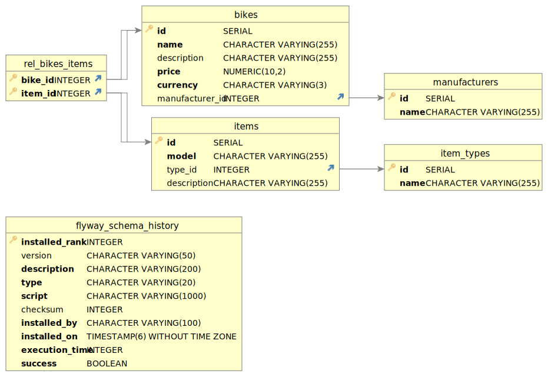

# bikes-api

### Arquitectura y librerías utilizadas

Se ha utilizado una arquitectura hexagonal aunque sin usar puertos/adaptadores de forma explícita.
Para separar la responsabilidad de cada capa he utiliza maven con multimódulos mediante la siguiente estructura:
- bikes-api-rest: módulo con la implementación del api rest mediante API-First.
- bikes-application: módulo con los casos de uso del api. No está acoplado a ninguna infraestructura ni a la parte rest. En esta parte pondría el resto de la lógica de negocio. 
- bikes-domain: módulo con el dominio de la aplicación, los modelos, las interfaces (puertos), etc.
- bikes-infrastructure: módulo con la parte de infrastructura (adaptadores de salida). Contiene la configuración de redis como caché y todo lo relacionado con postgres.
- bikes-migration: módulo que utiliza flyway para realizar las migraciones de la base de datos. Está configurado para que se ejecute al arrancar el microservicio. De esta forma se pueden realizar migraciones en la base de datos de una forma sencilla.

Se ha utilizado también mapstruct para realizar los mapeos de una forma sencilla. Por ejemplo al guardar un bicicleta cuando llega la petición, 
el objeto de entrada es un Dto, se mapea al objeto de dominio correspondiente, después se mapea a la entidad y después el resultado se mapea al objeto dominio 
correspondiente y este al Dto de salida para cumplir con el openapi definido.

Librerías principales utilizadas:
- spring-boot-starter-web
- spring-data-jpa
- junit 5
- mockito
- assertJ
- mapstruct
- flyway

En este microservicio me he centrado en añadir ciertas funcionalidades que comentaré a continuación 
dejando pendiente algunos temas como la gestión de errores, autenticación mediante JWT, etc.

La solución más sencilla de cara a insertar bicicletas con los items relacionados sería utilizar Mongo pero esto conllevaría 
tener muchos items duplicados, inconsistencia en los tipos de items, los fabricantes, etc. Por este motivo me he centrado 
en utilizar SQL mediante Postgres y diseñar la base de datos de forma normalizada mediente 3FN.

Diagrama de Entidad Relación:



He utilizado tablas "maestras" para manufactures y para item_types debido a que será un número limitado en ambos casos.
Y después he creado la tabla 'bikes' y la tabla 'items'. Estas tablas estan relacionadas n a n mediante la tabla 
'rel_bikes_items'. De esta forma puedes reutilizar los mismos items en distintas bicicletas.

Este diseño en la base de datos lo he tenido en cuenta en el endpoint que crea bicicletas para permitir reutilizar 
items existentes o para crear items nuevos.

#### Endpoints

- Crear bicicletas: path /bikes mediante POST. Este endpoint permite crear nuevas bicicletas utilizando items existente o nuevos items.

Ejemplo de uso:
```
curl --location --request POST 'localhost:8080/bikes' \
--header 'Content-Type: application/json' \
--header 'Accept: application/json' \
--data-raw '{
  "name": "Bicicleta de ejemplo",
  "price": 100,
  "currency": "EUR",
  "description": "Descripción de ejemplo",
  "manufacturer_id": 1,
  "existing_items": [
    1,
    2
  ],
  "new_items": [
    {
      "model": "Model de ejemplo",
      "type_id": 2,
      "description": "Descripcion de modelo"
    }
  ]
}'
```

- Buscar bicicletas: path /bikes mediante método GET. Los resultados de las búsquedas son cacheados y la caché se borra cuando se crea una bicicleta. 
Para esta gestión de caché me he basado en el supuesto de que habrá pocas creaciones y muchas búsquedas de forma que siempre se asegura la búsqueda exacta de bicicletas.  
Este endpoint permite buscar bicicletas utilizando los siguientes parámetros:
  - name: por nombre de bicicleta. No tiene que ser el nombre completo.
  - manufacturer: por nombre de fabricante. No tiene que ser completo.
  - item_type: por nombre de tipo de item. No tiene que ser completo.
  - manufacturer_id: por id de fabricante. A nivel de api tiene más sentido que por nombre si la integración es con un frontal y los fabricantes son limitados.
  - item_type_id: por id de tipo de item. A nivel de api tiene más sentido que por nombre si la integración es con un frontal y los tipos de items son limitados.
  - order: si tiene el valor "asc" se ordena de forma ascendente por nombre de bicicleta y en caso contrario se usa orde descendente.
  - page: número de página a obtener (empezando en 0).
  - size: tamaño de página a obtener (por defecto es 10).

Ejemplo de búsqueda de todas las bicicletas (hay dos bicicletas cargadas, ejecutar curl anterior para replicar resultado):
```
http://localhost:8080/bikes

{
  "results": [
    {
      "id": 1,
      "name": "Trek Top Fuel",
      "description": "Trek Top Fue",
      "price": 500,
      "currency": "EUR",
      "manufacturer": {
        "id": 3,
        "name": "Trek"
      },
      "items": [
        {
          "id": 1,
          "model": "Trek Madone",
          "type_id": 1,
          "type": "Cuadro",
          "description": "Trek Madone"
        },
        {
          "id": 4,
          "model": "Shimano SPD-SL",
          "type_id": 5,
          "type": "Pedal",
          "description": "Shimano SPD-SL"
        }
      ]
    },
    {
      "id": 2,
      "name": "Trek Domane",
      "description": "Trek Domane",
      "price": 600,
      "currency": "EUR",
      "manufacturer": {
        "id": 3,
        "name": "Trek"
      },
      "items": [
        {
          "id": 4,
          "model": "Shimano SPD-SL",
          "type_id": 5,
          "type": "Pedal",
          "description": "Shimano SPD-SL"
        },
        {
          "id": 2,
          "model": "Trek FX",
          "type_id": 1,
          "type": "Cuadro",
          "description": "Trek FX"
        }
      ]
    },
    {
      "id": 3,
      "name": "Bicicleta de ejemplo",
      "description": "Descripción de ejemplo",
      "price": 100,
      "currency": "EUR",
      "manufacturer": {
        "id": 1,
        "name": "Specialized"
      },
      "items": [
        {
          "id": 1,
          "model": "Trek Madone",
          "type_id": 1,
          "type": "Cuadro",
          "description": "Trek Madone"
        },
        {
          "id": 2,
          "model": "Trek FX",
          "type_id": 1,
          "type": "Cuadro",
          "description": "Trek FX"
        },
        {
          "id": 5,
          "model": "Model de ejemplo",
          "type_id": 2,
          "type": "Horquilla",
          "description": "Descripcion de modelo"
        }
      ]
    }
  ],
  "pagination": {
    "total_items": 3,
    "total_pages": 1,
    "current_page": 0,
    "size": 10
  }
}
```

Otros ejemplos:
- Ordenación ascendente: http://localhost:8080/bikes?order=asc
- Filtrado por nombre: http://localhost:8080/bikes?name=Trek
- Filtrado por nombre de fabricante: http://localhost:8080/bikes?manufacturer=Specialized
- Filtrado por id de fabricante: http://localhost:8080/bikes?manufacturer_id=3
- Filtrado por tipo de item (bicicleta insertada en curl): http://localhost:8080/bikes?item_type=Horquilla
- Filtrado por id de tipo de item: http://localhost:8080/bikes?item_type_id=1
- Consulta con paginación: http://localhost:8080/bikes?page=0&size=1

### Como ejecutar desde IDE

Compilar proyecto y ejecutar tests:
```shell
mvn clean install
```

Arrancar infraestructura:
```shell
docker compose -f docker-compose-local.yml up -d
```

Configurar jdk 17 y ejecutar el main de BikesApiApplication.

### Como ejecutar desde docker-compose

Ejecutar docker-compose:
```shell
docker compose up -d
```

En un equipo me funciona pero al probar en otro me da error en 'RUN mvn dependency:go-offline'.
Si esto ocurre, es posible que sea porque no puede descargar las dependencias.
En este caso para ejecutar recomiendo compilar en local primero y después ejecutar docker probando 
con la linea comentado si sigue fallando.

```shell
mvn clean install
docker compose up -d
```

Como curiosidad, hay un problema con la conexión a redis cuando el micro se ejecuta desde docker. 
Por este motivo desde esta versión la caché está desactivada pero desde la versión local funciona correctamente.

### Mejoras pendientes

Hay mejoras o tareas pendientes que no he realizado por motivos del tiempo que le he podido dedicar:
- Autenticación mediante JWT y uso de roles para permitir crear bicicletas al rol ADMIN y para buscar bicicletas al rol VIEWER
- Gestión de errores: incluir posibles errores en openapi y gestionar estos errores concretos mediante excepciones de negocio. Validación de inputs, intentar 
crear bicicleta con un item existente que en realidad no existe, etc.
- Tests de integración y de aceptación 
- Api reactiva
